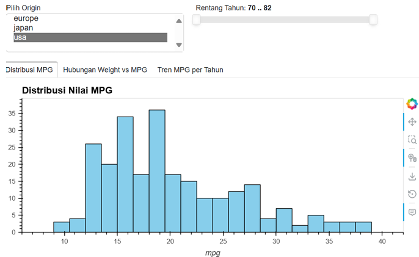
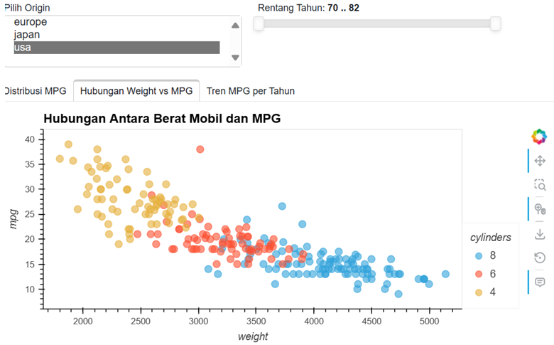
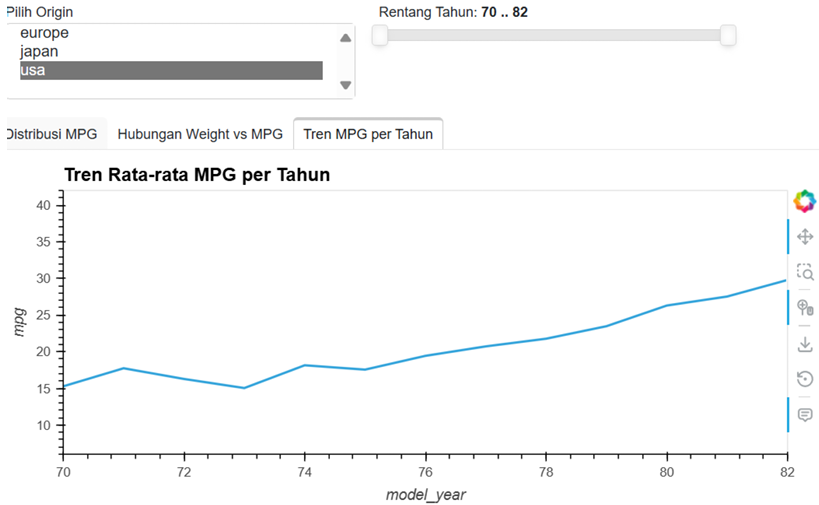

# MPG Dashboard Analysis

An interactive dashboard for exploring the **Auto MPG Dataset** using **Python, Panel, and hvPlot**. This project analyzes vehicle fuel efficiency based on factors such as vehicle weight, production year, and country of origin.

---

## Project Overview

The objective of this project is to explore patterns in vehicle fuel efficiency (Miles Per Gallon - MPG) through an interactive dashboard. Users can filter the data by vehicle origin and production year to gain insights into fuel consumption trends.

---

## Dataset

**Dataset:** Auto MPG Dataset

**Source:** https://raw.githubusercontent.com/mwaskom/seaborn-data/master/mpg.csv

### Features

| Variable | Description |
|----------|-------------|
| mpg | Miles Per Gallon (Fuel Efficiency) |
| cylinders | Number of engine cylinders |
| displacement | Engine displacement |
| horsepower | Horsepower |
| weight | Vehicle weight |
| acceleration | Acceleration |
| model_year | Production year |
| origin | Country of origin (USA, Europe, Japan) |
| name | Vehicle model |

---

## Project Objectives

- Explore the distribution of vehicle fuel efficiency.
- Analyze the relationship between vehicle weight and fuel efficiency.
- Examine fuel efficiency trends over time.
- Build an interactive dashboard for data exploration.

---

## Technologies Used

- Python
- Pandas
- Panel
- hvPlot
- Bokeh
- Jupyter Notebook

---

## Repository Structure

```
mpg-dashboard-analysis
│
├── data
│   └── mpg.csv
│
├── dashboard
│   └── app.py
│
├── notebooks
│   └── dashboard_analysis.ipynb
│
├── images
│   ├── dashboard_overview.png
│   ├── mpg_distribution.png
│   ├── weight_vs_mpg.png
│   └── mpg_trend.png
│
├── README.md
├── requirements.txt
├── LICENSE
└── .gitignore
```

---

## Dashboard Features

### Interactive Filters

- Vehicle Origin
- Production Year Range

### Dashboard Visualizations

- MPG Distribution (Histogram)
- Weight vs MPG (Scatter Plot)
- Average MPG Trend by Year (Line Chart)

---

## Dashboard Preview

### Dashboard Overview


---

### Distribution of MPG



---

### Weight vs MPG



---

### Average MPG Trend



---

## Key Insights

### 1. Distribution of Fuel Efficiency

- American vehicles generally have lower MPG values.
- Japanese and European vehicles tend to achieve higher fuel efficiency.

### 2. Weight vs MPG

- Vehicle weight has a strong negative relationship with fuel efficiency.
- Heavier vehicles generally consume more fuel.
- Four-cylinder vehicles achieve the highest MPG.

### 3. Fuel Efficiency Trend

- Average MPG steadily increased between 1970 and 1982.
- The most significant improvement occurred after 1976.
- Japanese manufacturers showed the greatest improvement in fuel efficiency over time.

---

## Business Insights

The dashboard indicates that reducing vehicle weight is an effective strategy for improving fuel efficiency. Manufacturers can leverage these findings to design lighter, more fuel-efficient vehicles while complying with energy efficiency regulations.

---

## How to Run

### Clone the repository

```bash
git clone https://github.com/hannazan/mpg-dashboard-analysis.git
```

### Install dependencies

```bash
pip install -r requirements.txt
```

### Launch the dashboard

```bash
panel serve dashboard/app.py --show
```

---

## Notebook

The notebook contains:

- Data Cleaning
- Exploratory Data Analysis (EDA)
- Data Visualization
- Business Insights

Location:

```
notebooks/dashboard_analysis.ipynb
```

---

## Author

**Hanna Zahra Nadia**

Mathematics Graduate | Aspiring Data Analyst & Data Scientist

- GitHub: https://github.com/hannazan
- LinkedIn: *https://linkedin.com/in/hannazan*

---

## Future Improvements

- Add more interactive filters.
- Deploy the dashboard using Hugging Face Spaces or Render.
- Include statistical analysis for deeper insights.
- Build predictive models for fuel efficiency.